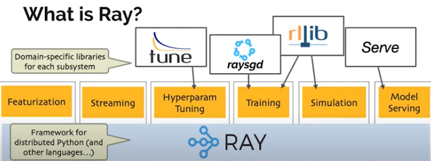
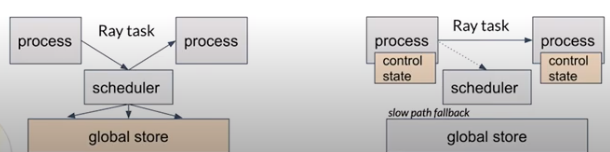

# Title: GitHub收集项目维护

[TOC]

---

## 1 编程语言

### Python

#### 编程经验

1. [编码技巧、最佳实践与思维模式](https://github.com/piglei/one-python-craftsman)
2. [PySnooper](https://github.com/cool-RR/PySnooper)：Never use print for debugging again
3. [The Flask Mega-Tutorial教程](https://github.com/luhuisicnu/The-Flask-Mega-Tutorial-zh)
4. [在 Windows 上使用 Python 进行开发，微软教程](https://docs.microsoft.com/zh-cn/windows/python/)
5. [realpython / python-guide](https://github.com/realpython/python-guide)
6. [依赖包建立工具 pipreqs](https://github.com/bndr/pipreqs)
7. [starlette ：The little ASGI framework that shines](https://github.com/encode/starlette)
8. [tiangolo / fastapi](https://github.com/tiangolo/fastapi)
9. [python-small-examples](https://github.com/jackzhenguo/python-small-examples)
10. [pytudes](https://github.com/norvig/pytudes)：Python programs to practice or demonstrate skills.
11. [C++联合编程] [cppyy: Automatic Python-C++ bindings](https://cppyy.readthedocs.io/en/latest/); [SWIG](http://www.swig.org/); [PyBind11](https://github.com/pybind/pybind11); [`ctypes`](https://docs.python.org/3/library/ctypes.html#module-ctypes)
    - [微软Doc](https://docs.microsoft.com/en-us/visualstudio/python/working-with-c-cpp-python-in-visual-studio?view=vs-2019)

#### 开源项目

##### 爬虫

1. [收集各种爬虫 （默认爬虫语言为 python）](https://github.com/facert/awesome-spider)
2. [lazynlp](https://github.com/chiphuyen/lazynlp)：Library to scrape and clean web pages to create massive datasets.
3. **[ WeiboSpider](https://github.com/nghuyong/WeiboSpider)**: This is a sina weibo spider built by scrapy [微博爬虫/持续维护]
4. [webspider](https://github.com/JustForFunnnn/webspider)：数据库用的是`MySQL`, 主要用到的库是`celery`和`requests`，并实现了定时任务，出错重试，日志记录，自动更改`Cookies`等的功能
5. **[ scrapyscript](https://github.com/jschnurr/scrapyscript)**：Run a Scrapy spider programmatically from a script or a Celery task
6. [pspider](https://github.com/zhao94254/pspider)：一个简单的分布式爬虫框架
7. [taoyoulue_spider](https://github.com/runtangr/taoyoulue_spider)：基于mongodb存储，redis缓存，celery 实现的分布式爬虫。
8. [DeadPool](https://github.com/Ryuchen/DeadPool)：使用celery作为主体框架的爬虫应用，能够灵活的添加爬虫任务，并且同时运行多站点的爬虫工作
9. [python-bloomfilter](https://github.com/jaybaird/python-bloomfilter)：Scalable Bloom Filter implemented in Python

##### 其他

1. [python-goose](https://github.com/grangier/python-goose)：Goose 用于文章提取器
2. [python-gems](https://github.com/RealHacker/python-gems)：有趣的 Pyhton 代码片段集合
3. [listen1](https://github.com/listen1)：Listen 1 让你用一个网页就能听到多个网站的在线音乐，支持各种平台
4. [beijing_bus](https://github.com/wong2/beijing_bus)：北京实时公交，可以显示查询的公交到达某站还需多久
5. [tushare](https://github.com/waditu/tushare)：TuShare 是一个免费、开源的 Python 财经数据接口包，[TuShare 文档](http://tushare.org/index.html) 
6. [Supervisor](https://github.com/Supervisor/supervisor)：是实际企业常用的一款 Linux/Unix 系统下的一个进程管理工具
7. [**pyecharts**](https://github.com/pyecharts/pyecharts)：pyecharts是一个由 Echarts+Python 实现的一个用于生成 Echarts 图表的类库
8. [FeelUOwn](https://github.com/cosven/FeelUOwn)：FeelUOwn 是一个用Python写的，面向Linux/macOS平台的开源音乐播放器
9. [**superset**](https://github.com/apache/incubator-superset)：superset是一个实际企业级开发项目，由 airbnb用 Python开发的数据探索
10. [**Spug**](https://github.com/openspug/spug)：Spug 是一款使用 Python+Flask+Vue+Element 组件开发的开源运维管理系统
11. [manim](https://github.com/3b1b/manim)：Animation engine for explanatory math videos
12. [bandit](https://github.com/PyCQA/bandit)：Bandit is a tool designed to find common security issues in Python code.

##### 异步

1. [celery](https://github.com/celery/celery)：Distributed Task Queue (development branch)【master-worker模式】【轻量级】

##### 字符串搜索

1. [pyahocorasick](https://github.com/WojciechMula/pyahocorasick)：**pyahocorasick** is a fast and memory efficient library for exact or approximate multi-pattern string search meaning that you can find multiple key strings occurrences at once in some input text. 
   - AC自动机：https://xueyouluo.github.io/Aho-Corasick-algorithm/
2. [ahocorapy](https://github.com/abusix/ahocorapy): Pure python Aho-Corasick library.
3. [acora](https://github.com/scoder/acora): Fast multi-keyword search engine for text strings.
4. [datrie](https://github.com/pytries/datrie)：Fast, efficiently stored Trie for Python. Uses libdatrie. http://pypi.python.org/pypi/datrie/

##### 工具API

1. [python-wechaty-getting-started](https://github.com/wechaty/python-wechaty-getting-started)：Python Wechaty Starter Project Template that Works Out-of-the-Box。Wechaty is a RPA SDK for Wechat **Individual** Account that can help you create a chatbot in 9 lines of Python.
2. [python-wechaty](https://github.com/wechaty/python-wechaty)

##### 工具库

1. [rich](https://github.com/willmcgugan/rich)：Rich is a Python library for rich text and beautiful formatting in the terminal.
2. [apscheduler](https://github.com/agronholm/apscheduler)：Task scheduling library for Python

---

### C++

#### 编程书籍

1. 第一本 Essential C++ (由c过度到c++）
2. 第二本 C++ Primer第四版 (内容很全，但是不深）
3. 第三本 Effective C++
4. 第四本 More Effective C++(较深一些)
5. 第五本 C++ 标准程序库
6. 第六本 深入探索C++对象模型
7. [CPlusPlusThings](https://github.com/Light-City/CPlusPlusThings)：C++那些事
8. 

#### 开源项目

1. cjson网址：https://sourceforge.net/projects/cjson/  麻雀虽小五脏俱全
   MyTinySTL网址：https://github.com/Alinshans/MyTinySTL  stl
   oatpp网址：https://github.com/oatpp/oatpp  web框架
   Tinyhttpd网址：https://github.com/EZLippi/Tinyhttpd/blob/master/httpd.c  http server
   nginx网址：http://nginx.org/   静态服务器
   Redis网址：https://redis.io/download     redis高速缓存  较难
2. C++ 的 JSON 库 ：[json](https://github.com/nlohmann/json)
3. 中文文档计算出对应的 simhash 值。simhash 是谷歌用来进行文本去重的算法（[详见 simhash 算法原理及实现](http://yanyiwu.com/work/2014/01/30/simhash-shi-xian-xiang-jie.html)）[simhash](https://github.com/yanyiwu/simhash)
4. 语言技术平台（Language Technology Platform，LTP）是哈工大社会计算与信息检索研究中心历时十年开发的一整套中文语言处理系统：[ltp](https://github.com/HIT-SCIR/ltp)
5. 贪吃蛇游戏 AI 版：[Snake](https://github.com/stevennl/Snake)
6. Markdown 编辑软件：[vnote](https://github.com/tamlok/vnote)
7. Redis 桌面管理工具：
8. [taichi](https://github.com/taichi-dev/taichi)：Productive & portable programming language for high-performance, sparse & differentiable computing
9. [Sourcetrail](https://github.com/CoatiSoftware/Sourcetrail)：Sourcetrail - free and open-source interactive source explorer，代码结构可视化
10. [keepassx](https://github.com/keepassx/keepassx)： a cross platform port of the windows application “Keepass Password Safe”.

### Julia

1. [ julia_notebooks](https://github.com/ageron/julia_notebooks)：Julia Jupyter/Colab Notebooks
2. [julia](https://github.com/JuliaLang/julia)：The Julia Language: A fresh approach to technical computing.

---

### Java

1. [SpringAll](https://github.com/wuyouzhuguli/SpringAll)：循序渐进，学习Spring Boot、Spring Boot & Shiro、Spring Batch、Spring Cloud、Spring Cloud Alibaba、Spring Security & Spring Security OAuth2

***

### GO

1. [7days-golang](https://github.com/geektutu/7days-golang)：7 days golang apps from scratch

---

### 数据结构与算法

1. [数据结构和算法必知必会的50个代码实现](https://github.com/wangzheng0822/algo)

2. [Python算法实现-轻量级](https://github.com/qiwsir/algorithm)   [用动画的形式呈现解LeetCode题目的思路-轻量级](https://github.com/MisterBooo/LeetCodeAnimation)

3. [Tech Interview Guide 技术面试必备基础知识](https://github.com/CyC2018/CS-Notes)

4. [C++ ：Play-Leetcode](https://github.com/liuyubobobo/Play-Leetcode)

5. [深度学习500问](https://github.com/scutan90/DeepLearning-500-questions)

6. [算法/深度学习/NLP面试笔记](https://github.com/imhuay/Algorithm_Interview_Notes-Chinese)

7. [Algorithm_Interview_Notes-Chinese](https://github.com/DarLiner/Algorithm_Interview_Notes-Chinese)

8. [ML-Interview](https://github.com/ms-sharma/ML-Interview)

9. [All Algorithms implemented in Python](https://github.com/TheAlgorithms/Python)

10. [algorithms：Minimal examples of data structures and algorithms in Python](https://github.com/keon/algorithms)

11. [Algorithms implemented in C++：For education](https://github.com/TheAlgorithms/C-Plus-Plus)

12. 数据结构与算法，coursera 

    > https://github.com/huyvohcmc/coursera-dsa py
    >
    > https://github.com/xuwd11/Coursera_Data_Structures_and_Algorithms_Specialization py
    >
    > https://github.com/manparvesh/coursera-ds-algorithms cpp
    >
    > https://github.com/MaxPoon/Data-Structure-and-Algorithms/tree/master/coursera-Data-Structures-and-Algorithms-specialization py
    >
    > https://github.com/HUMANIAM/Algorithms_DataStructure_Specialization  cpp
    >
    > https://github.com/AndriiShostatskyi/Genome-Assembly-Programming-Challenge  cpp

13. [fucking-algorithm](https://github.com/labuladong/fucking-algorithm)：刷算法全靠套路，labuladong

14. [leetcode_company_wise_questions](https://github.com/MysteryVaibhav/leetcode_company_wise_questions) ：按公司分类的题目列表

### 计算机科学基础

1. [计算机速成课](https://github.com/1c7/Crash-Course-Computer-Science-Chinese)
2. [TeachYourselfCS-CN](https://github.com/keithnull/TeachYourselfCS-CN)
3. [computer-science](https://github.com/ossu/computer-science)：🎓 Path to a free self-taught education in Computer Science!
4. [REKCARC-TSC-UHT](https://github.com/PKUanonym/REKCARC-TSC-UHT)：清华大学计算机系课程攻略
5. [zju-icicles](https://github.com/QSCTech/zju-icicles)：浙江大学课程攻略共享计划
6. [CS-Xmind-Note](https://github.com/SSHeRun/CS-Xmind-Note)：计算机专业课（408）思维导图和笔记：计算机组成原理（第五版 王爱英），数据结构（王道），计算机网络（第七版 谢希仁），操作系统（第四版 汤小丹）
7. [awesome-courses](https://github.com/prakhar1989/awesome-courses)：List of awesome university courses for learning Computer Science!

#### CSAPP

深入理解计算机系统：[videos&lectures](https://www.cs.cmu.edu/afs/cs/academic/class/15213-f15/www/schedule.html)

1. labs： https://github.com/Exely/CSAPP-Labs

#### 系统设计

**[ system-design-primer](https://github.com/donnemartin/system-design-primer)** Learn how to design large-scale systems.

#### 架构技能树

**[architect-awesome](https://github.com/xingshaocheng/architect-awesome)**

***

### 自己动手写项目

1. [danistefanovic / build-your-own-x](https://github.com/danistefanovic/build-your-own-x)：Build your own (insert technology here) 
2. [bregman-arie / devops-exercises](https://github.com/bregman-arie/devops-exercises)：Linux, Jenkins, AWS, SRE, Prometheus, Docker, Python, Ansible, Git, Kubernetes, Terraform, OpenStack, SQL, NoSQL, Azure, GCP, DNS, Elastic, Network, Virtualization

### 其他语言

1. [purr-data](https://github.com/agraef/purr-data)：Pure Data (aka Pd) is a visual programming language.

---

## 2 深度学习

### 损失函数

1. [self-adj-dice](https://github.com/fursovia/self-adj-dice)：Implementation of Self-adjusting Dice Loss from "Dice Loss for Data-imbalanced NLP Tasks" paper
2. 

### 算法实现

#### NLP

- [nlp-recipes](https://github.com/microsoft/nlp-recipes)：Natural Language Processing Best Practices & Examples
- [checklist](https://github.com/marcotcr/checklist)：多种方法评测NLP/NLG任务，颠覆多种SOTA模型在传统评测指标下的结论。
- [NLP-pretrained-model](https://github.com/balavenkatesh3322/NLP-pretrained-model)：A collection of Natural language processing pre-trained models.
- [EasyTransfer](https://github.com/alibaba/EasyTransfer)：EasyTransfer is designed to make the development of transfer learning in NLP applications easier.
- [google-research / language](https://github.com/google-research/language)：Shared repository for open-sourced projects from the Google AI Language team.

##### Transformer

1. [delight](https://github.com/sacmehta/delight)：DeLighT: Very Deep and Light-Weight Transformers. [DeFINE (ICLR'20)](https://openreview.net/pdf?id=rJeXS04FPH) and [DeLighT (preprint)](https://arxiv.org/pdf/2008.00623.pdf).
2. [Transformer-Clinic](https://github.com/LiyuanLucasLiu/Transformer-Clinic)：Understanding the Difficulty of Training Transformers
3. [rezero](https://github.com/majumderb/rezero)：This repository contains the ReZero-Transformer implementation from the paper. It matches Pytorch's Transformer and can be easily used as a drop-in replacement. [**ReZero is All You Need: Fast Convergence at Large Depth**](https://arxiv.org/abs/2003.04887); *ArXiv, March 2020*. 

##### 2 预训练模型  

- [awesome-bert](https://github.com/Jiakui/awesome-bert): BERT、XLNet 相关论文和 github 项目

- [TensorFlow 官方 code and pre-trained models for BERT](https://github.com/facebookresearch/fastText)

- [UER-py](https://github.com/dbiir/UER-py)：Open Source Pre-training Model Framework in PyTorch & Pre-trained Model Zoo

- huggingface [transformers](https://github.com/huggingface/transformers)：Transformers: State-of-the-art Natural Language Processing for Pytorch and TensorFlow 2.0.

- [ERINE](https://github.com/PaddlePaddle/ERNIE)：An Implementation of ERNIE For Language Understanding (including Pre-training models and Fine-tuning tools)

- [ERNIE-Pytorch](https://github.com/nghuyong/ERNIE-Pytorch)

- [五行代码玩转GPT-2Easy-to-use Wrapper for GPT-2](https://github.com/rish-16/gpt2client)

- [ Facebook AI ](https://ai.facebook.com/)

- [google-research / text-to-text-transfer-transformer](https://github.com/google-research/text-to-text-transfer-transformer)

- [bert-as-service](https://github.com/hanxiao/bert-as-service)：Mapping a variable-length sentence to a fixed-length vector using BERT model

- [Chinese-BERT-wwm](https://github.com/ymcui/Chinese-BERT-wwm): Pre-Training with Whole Word Masking for Chinese BERT（中文BERT-wwm系列模型）

- [Chinese-ELECTRA](https://github.com/ymcui/Chinese-ELECTRA)：Pre-trained Chinese ELECTRA（中文ELECTRA预训练模型）

- [bert-for-tf2](https://github.com/kpe/bert-for-tf2)：A Keras TensorFlow 2.0 implementation of BERT, ALBERT and adapter-BERT.

- [bert4keras](https://github.com/bojone/bert4keras)：keras implement of transformers for humans

- [ERNIE-Pytorch](https://github.com/nghuyong/ERNIE-Pytorch): This project is to convert [ERNIE](https://github.com/PaddlePaddle/ERNIE) to [huggingface's](https://github.com/huggingface/pytorch-transformers) format.

- #####  XLnet

  - https://github.com/zihangdai/xlnet
  - https://github.com/graykode/xlnet-Pytorch

- [marge-pytorch](https://github.com/lucidrains/marge-pytorch)：Implementation of Marge, **Pre-training via Paraphrasing**, in Pytorch

- [BERT-CCPoem](https://github.com/THUNLP-AIPoet/BERT-CCPoem)：BERT-CCPoem is an BERT-based pre-trained model particularly for Chinese classical poetry

- [microsoft](https://github.com/microsoft)/**[Unicoder](https://github.com/microsoft/Unicoder)** : Unicoder model for understanding and generation. This repo provides the code for reproducing the experiments in [XGLUE: A New Benchmark Dataset for Cross-lingual Pre-training, Understanding and Generation](https://arxiv.org/abs/2004.01401) ([`leaderboard`](https://microsoft.github.io/XGLUE/)).

##### * 其他语言模型

- T5： https://github.com/google-research/text-to-text-transfer-transformer   [中文博客](https://mp.weixin.qq.com/s?__biz=MjM5ODkzMzMwMQ==&mid=2650411701&idx=2&sn=f253b2cde92e0be27e4cdb010f8f957a&chksm=becd94ef89ba1df9c417810e83fe2b06686b5f43f550d9335e7b4ebcccb99678d0fbe7b90910&scene=21#wechat_redirect)
- google-research https://github.com/google-research/google-research 
- [ELECTRA: 超越BERT, 19年最佳NLP预训练模型]( https://zhuanlan.zhihu.com/p/89763176 )
- ZEN中文预训练语言模型： https://github.com/sinovation/ZEN 
- [albert](https://github.com/google-research/albert)：ALBERT: A Lite BERT for Self-supervised Learning of Language Representations
- [GPT2-Chinese](https://github.com/Morizeyao/GPT2-Chinese)
- [gpt2-ml](https://github.com/imcaspar/gpt2-ml)：GPT2 for Multiple Languages, including pretrained models. GPT2 多语言支持, 15亿参数中文预训练模型

##### 3 CRF、LAN

- label-attention inference  https://github.com/oxford-cs-deepnlp-2017/lectures/blob/master/README.md 
-   https://arxiv.org/abs/1908.08676 

##### * CLUE项目合辑（NLP）

CLUE：Organization of Language Understanding Evaluation benchmark for Chinese

1. [CLUEPretrainedModels：高质量中文预训练模型集合：最先进大模型、最快小模型、相似度专门模型](https://github.com/CLUEbenchmark/CLUEPretrainedModels)
2. [CLUECorpus2020：Large-scale Pre-training Corpus for Chinese 100G 中文预训练语料](https://github.com/CLUEbenchmark/CLUECorpus2020)
3. [CLUEDatasetSearch：搜索所有中文NLP数据集](https://github.com/CLUEbenchmark/CLUEDatasetSearch)
4. [CLUE：中文任务基准测评结果](https://github.com/CLUEbenchmark/CLUE)
5. [CLGE：中文生成任务基准测评结果](https://github.com/CLUEbenchmark/CLGE)
6. [ELECTRA：中文 预训练 ELECTRA 模型: 基于对抗学习](https://github.com/CLUEbenchmark/ELECTRA)
7. [CLUENER2020：中文细粒度命名实体识别](https://github.com/CLUEbenchmark/CLUENER2020)
8. [CLUEmotionAnalysis2020：细粒度情感分析数据集](https://github.com/CLUEbenchmark/CLUEmotionAnalysis2020)
9. [DistilBert： 海量中文预训练蒸馏bert模型](https://github.com/CLUEbenchmark/DistilBert)
10. [MobileQA: 离线端阅读理解应用 QA for mobile, Android](https://github.com/CLUEbenchmark/MobileQA)

##### * BERT Applications

- [rasa_chatbot_cn](https://github.com/GaoQ1/rasa_chatbot_cn):基于最新版本rasa搭建的对话系统
- [Bert-Chinese-Text-Classification-Pytorch](https://github.com/649453932/Bert-Chinese-Text-Classification-Pytorch):使用Bert，ERNIE，进行中文文本分类
- [BERT-train2deploy](https://github.com/xmxoxo/BERT-train2deploy)：BERT模型从训练到部署
- [rasa-tutorial](https://github.com/terrifyzhao/rasa-tutorial)：Rasa中文demo与指南
- [rasa-ui](https://github.com/paschmann/rasa-ui): Rasa UI is a frontend for the Rasa Framework
- [text_matching](https://github.com/terrifyzhao/text_matching)：常用文本匹配模型tf版本，数据集为QA_corpus
- [sentence-transformers](https://github.com/UKPLab/sentence-transformers)：Sentence Embeddings with BERT & XLNet, https://arxiv.org/abs/1908.10084
- [labse](https://github.com/bojone/labse)：Language-agnostic BERT Sentence Embedding (LaBSE)
- [BERTopic](https://github.com/MaartenGr/BERTopic)：BERTopic is a topic modeling technique that leverages BERT embeddings and c-TF-IDF to create dense clusters allowing for easily interpretable topics whilst keeping important words in the topic descriptions.
- [Top2Vec](https://github.com/ddangelov/Top2Vec)：Top2Vec is an algorithm for **topic modeling** and **semantic search**. It automatically detects topics present in text and generates jointly embedded topic, document and word vectors.

##### * NER

- [spert](https://github.com/markus-eberts/spert)：PyTorch code for SpERT: "Span-based Entity and Relation Transformer". For a description of the model and experiments, see our paper: https://arxiv.org/abs/1909.07755 (accepted at ECAI 2020).
- [mrc-for-flat-nested-ner](https://github.com/pranciskus/mrc-for-flat-nested-ner)：The code for "A Unified MRC Framework for Named Entity Recognition"
- [AutoNER](https://github.com/shangjingbo1226/AutoNER): Learning Named Entity Tagger from Domain-Specific Dictionary. [远程监督方法](https://www.cnblogs.com/Luv-GEM/p/11598294.html)训练，利用无标注数据。

> - Inference:
>   - **[LightNER](https://github.com/LiyuanLucasLiu/LightNER)**: inference w. models pre-trained / trained w. *any* following tools, *efficiently*.
> - Training:
>   - **[LD-Net](https://github.com/LiyuanLucasLiu/LD-Net)**: train NER models w. efficient contextualized representations.
>   - **[VanillaNER](https://github.com/LiyuanLucasLiu/Vanilla_NER)**: train vanilla NER models w. pre-trained embedding.
> - Distant Training:
>   - **[AutoNER](https://shangjingbo1226.github.io/AutoNER/)**: train NER models w.o. line-by-line annotations and get competitive performance.

##### ELMo

- [bilm-tf](https://github.com/allenai/bilm-tf)：Tensorflow implementation，allen ai
- [预训练模型](https://allennlp.org/elmo)
- [ELMoForManyLangs](https://github.com/HIT-SCIR/ELMoForManyLangs): 中文模型

##### 4 相似度匹配

- [cail2019](https://github.com/padeoe/cail2019)：法研杯2019相似案例匹配第二名解决方案（附数据集和文档）
- [StarSpace](https://github.com/facebookresearch/StarSpace)：Learning embeddings for classification, retrieval and ranking.
- [DSSM](https://github.com/airalcorn2/Deep-Semantic-Similarity-Model)
- [Chinese-sentence-similarity-task](https://github.com/ShuaichiLi/Chinese-sentence-similarity-task)：中文问题句子相似度计算比赛及方案汇总
- [Question-Answering-Albert-Electra](https://github.com/renatoviolin/Question-Answering-Albert-Electra) : Question Answering using Albert and Electra
- [simbert](https://github.com/ZhuiyiTechnology/simbert)：a bert for retrieval and generation
- [haystack](https://github.com/deepset-ai/haystack)： Transformers at scale for question answering & search

##### * 文本分类

- [text_classification](https://github.com/brightmart/text_classification)：all kinds of text classification models and more with deep learning
- [Chinese-Text-Classification-Pytorch](https://github.com/649453932/Chinese-Text-Classification-Pytorch)：中文文本分类，TextCNN，TextRNN，FastText，TextRCNN，BiLSTM_Attention，DPCNN，Transformer，基于pytorch，开箱即用
- [TextClassificationBenchmark](https://github.com/wabyking/TextClassificationBenchmark)：A Benchmark of Text Classification in PyTorch
- [Bert-Chinese-Text-Classification-Pytorch](https://github.com/649453932/Bert-Chinese-Text-Classification-Pytorch)：使用Bert，ERNIE，进行中文文本分类
- [multi-class-text-classification-cnn](https://github.com/jiegzhan/multi-class-text-classification-cnn)：Classify Kaggle Consumer Finance Complaints into 11 classes. Build the model with CNN (Convolutional Neural Network) and Word Embeddings on Tensorflow.
- [deep-text-classifier-mtl](https://github.com/dhwajraj/deep-text-classifier-mtl)：tensorflow script for multi-task learning implementation of Kim's paper : Convolutional Neural Networks for Sentence Classification.
- [multi_task-nlp-bert](https://github.com/ZagHe568/multi_task-nlp-bert)： NLP multi-task learning, which includes single-sentence classification, pairwise text similarity, pairwise text classification, and relevance ranking.
- [TextFooler](https://github.com/jind11/TextFooler)：A Model for Natural Language Attack on Text Classification and Inference【对抗攻击】
- [lightning-text-classification](https://github.com/minimalist-nlp/lightning-text-classification)：Minimalist implementation of a BERT Sentence Classifier with PyTorch Lightning, Transformers and PyTorch-NLP.
- [Sequence Projection Models](https://github.com/tensorflow/models/tree/master/research/sequence_projection) >> [**PRADO**]：A family of models that projects sequence to fixed sized features. The idea behind is to build embedding-free models that minimize the model size. Instead of using embedding table to lookup embeddings, sequence projection models computes them on the fly.

##### *  Aspect Based Sentiment Analysis

- [ABSA-PyTorch](https://github.com/songyouwei/ABSA-PyTorch)：基于方面的情感分析，使用PyTorch实现。
- [BERT-for-RRC-ABSA](https://github.com/howardhsu/BERT-for-RRC-ABSA)：code for our NAACL 2019 paper: "BERT Post-Training for Review Reading Comprehension and Aspect-based Sentiment Analysis"
- [Aspect-Based-Sentiment-Analysis](https://github.com/ScalaConsultants/Aspect-Based-Sentiment-Analysis)：Aspect-Based-Sentiment-Analysis: Transformer & Explainable ML (TensorFlow)

##### 5 文本摘要

- [**textsum**](https://github.com/tensorflow/models/tree/master/research/textsum)：Sequence-to-Sequence with Attention Model for Text Summarization.
- [sumy](https://github.com/miso-belica/sumy)：Module for automatic summarization of text documents and HTML pages.
- [pointer_summarizer](https://github.com/atulkum/pointer_summarizer)：pytorch implementation of "Get To The Point: Summarization with Pointer-Generator Networks"
- [pointer-generator](https://github.com/abisee/pointer-generator)：Code for the ACL 2017 paper "Get To The Point: Summarization with Pointer-Generator Networks"
- [transformer-pointer-generator](https://github.com/policeme/transformer-pointer-generator)： Transformer and Pointer-generator
- [BertSum](https://github.com/nlpyang/BertSum)：Code for paper Fine-tune BERT for Extractive Summarization
- [hiersumm](https://github.com/nlpyang/hiersumm)：Code for paper Hierarchical Transformers for Multi-Document Summarization in ACL2019
- [**rouge**](https://github.com/google-research/google-research/tree/master/rouge)
- [pegasus](https://github.com/google-research/pegasus)：Pre-training with Extracted Gap-sentences for Abstractive SUmmarization Sequence-to-sequence models, or PEGASUS, uses self-supervised objective Gap Sentences Generation (GSG) to train a transformer encoder-decoder model.
- [awesome-text-summarization](https://github.com/icoxfog417/awesome-text-summarization)：The guide to tackle with the Text Summarization

##### 6 seq2seq

- [OpenSeq2Seq](https://github.com/NVIDIA/OpenSeq2Seq)：Toolkit for efficient experimentation with Speech Recognition, Text2Speech and NLP
- [Magenta: Music and Art Generation with Machine Intelligence](https://github.com/tensorflow/magenta)：involves developing new deep learning and reinforcement learning algorithms for generating songs, images, drawings, and other materials.
- [exdeep-nmt](https://github.com/namisan/exdeep-nmt)：代码审核中

##### * QA

- **[ qa_match](https://github.com/wuba/qa_match)**：A simple effective ToolKit for short text matching
- [QA-Survey](https://github.com/BDBC-KG-NLP/QA-Survey)：对问答系统的调研。
- [QueryGeneration](https://github.com/YunwenTechnology/QueryGeneration)：Conversational Standard Meta Language

##### 7 ModelZoo

- [***Gathers machine learning and Tensorflow deep learning models for NLP problems](https://github.com/huseinzol05/NLP-Models-Tensorflow)
- [MatchZoo 是一个通用的文本匹配工具包](https://github.com/NTMC-Community/MatchZoo): deep text matching models
- [awesome-sentence-embedding](https://github.com/Separius/awesome-sentence-embedding)
- [Awesome-Chinese-NLP](https://github.com/crownpku/Awesome-Chinese-NLP)：中文自然语言处理相关资料

##### 8 开源包

- [Open-Source Neural Machine Translation in Tensorflow](https://github.com/EdinburghNLP/nematus)
- [Gluon-NLP made easy](https://github.com/dmlc/gluon-nlp)
- [SnowNLP：Python library for processing Chinese text](https://github.com/isnowfy/snownlp)
- [gensim – Topic Modelling in Python](https://github.com/RaRe-Technologies/gensim)
- [PyText](https://github.com/facebookresearch/pytext)：A natural language modeling framework based on PyTorch，is a deep-learning based NLP modeling framework built on PyTorch.
- [allennlp：An open-source NLP research library, built on PyTorch](https://github.com/allenai/allennlp)
- [结巴中文分词](https://github.com/fxsjy/jieba)
- [lda2vec: Tools for interpreting natural language](https://github.com/cemoody/lda2vec)
- [复旦 fastNLP](https://github.com/fastnlp/fastNLP)：: A Modularized and Extensible NLP Framework. Currently still in incubation.
- [fast text： representation and classification.](https://github.com/facebookresearch/fastText)
- [autotuning for fastText](https://ai.facebook.com/blog/fasttext-blog-post-open-source-in-brief/)
- [HanLP](https://github.com/hankcs/HanLP)
- [pkuseg多领域中文分词工具](https://github.com/lancopku/pkuseg-python)：pkuseg简单易用，支持细分领域分词，有效提升了分词准确度
- [ An open-source neural machine translation toolkit 清华](https://github.com/THUNLP-MT/THUMT/tree/d4cb62c215d846093e5357aa17b286506b2df1af)
- [Neural Modules: a toolkit for conversational AI](https://github.com/NVIDIA/NeMo)
- [stanza: Official Stanford NLP Python Library for Many Human Languages](https://github.com/stanfordnlp/stanza)  [Doc](https://readthedocs.org/projects/stanza/)
- [StarSpace](https://github.com/facebookresearch/StarSpace)：Learning embeddings for classification, retrieval and ranking.
- [BigARTM](http://docs.bigartm.org/en/stable/index.html)：topic model
- [tkitMarker_bert](https://github.com/napoler/tkitMarker_bert)：使用bert微调提取实体，描述
- [fastHan](https://github.com/fastnlp/fastHan)：fastHan是基于fastNLP与pytorch实现的中文自然语言处理工具，像spacy一样调用方便。
- [Jiagu](https://github.com/ownthink/Jiagu)：Jiagu深度学习自然语言处理工具 知识图谱关系抽取 中文分词 词性标注 命名实体识别 情感分析 新词发现 关键词 文本摘要 文本聚类
- [KILT](https://github.com/facebookresearch/KILT)：A Benchmark for Knowledge Intensive Language Tasks。
- [AutoPhrase](https://github.com/shangjingbo1226/AutoPhrase)：Automated Phrase Mining from Massive Text Corpora
- [Kashgari-doc-zh](https://github.com/BrikerMan/Kashgari-doc-zh) [Kashgari](https://github.com/BrikerMan/Kashgari)：Kashgari 是一个极简且强大的 NLP 框架，可用于文本分类和标注的学习，研究及部署上线
- [Senta](https://github.com/baidu/Senta)：Baidu's open-source Sentiment Analysis System.
- [DDParser](https://github.com/baidu/DDParser)：百度开源的依存句法分析系统
- [FastBERT](https://github.com/autoliuweijie/FastBERT)
- [OpenMatch](https://github.com/thunlp/OpenMatch)：An Open-Source Package for Information Retrieval.

##### 9 其他model

- [show-attend-and-tell](https://github.com/yunjey/show-attend-and-tell)
- [Retrieval-Based Conversational Model in Tensorflow](https://github.com/dennybritz/chatbot-retrieval)

#####  10 Book代码

   - [Natural Language Processing with PyTorch](https://github.com/joosthub/PyTorchNLPBook)
##### 11 可视化

- [**Text Visualization Browser**](https://textvis.lnu.se/)

##### 12 最新研究进展

   - [track the progress in Natural Language Processing (NLP)](https://github.com/sebastianruder/NLP-progress)
   - [Repository to show how NLP can tacke real problem.](https://github.com/makcedward/nlp)

##### 13 关系抽取

- [Snowball](https://github.com/davidsbatista/Snowball)：Snowball: Extracting Relations from Large Plain-Text Collections
- [OpenNRE](https://github.com/thunlp/OpenNRE)： relation extraction models.
- [MRC4ERE_plus](https://github.com/TanyaZhao/MRC4ERE_plus)：Implementation for Paper "Asking Effective and Diverse Questions: A Machine Reading Comprehension based Framework for Joint Entity-Relation Extraction"
- [AlpacaTag](https://github.com/INK-USC/AlpacaTag)：AlpacaTag: An **Active Learning**-based Crowd Annotation Framework for Sequence Tagging (ACL 2019 Demo)

##### 14 蒸馏

- [TextBrewer](https://github.com/airaria/TextBrewer)：A PyTorch-based knowledge distillation toolkit for natural language processing

##### 15 对话

- [DeepPavlov](https://github.com/deepmipt/DeepPavlov)：An open source library for deep learning end-to-end dialog systems and chatbots.
- [ConvLab-2](https://github.com/thu-coai/ConvLab-2)：ConvLab-2: An Open-Source Toolkit for Building, Evaluating, and Diagnosing Dialogue Systems
- [rasa-chatbot](https://github.com/samik-saha/rasa-chatbot)：Sample chatbot with rasa stack
- [nezha_gpt_dialog](https://github.com/bojone/nezha_gpt_dialog)
- [DialoGPT](https://github.com/microsoft/DialoGPT)：Large-scale pretraining for dialogue
- [CDial-GPT](https://github.com/thu-coai/CDial-GPT)：A Large-scale Chinese Short-Text Conversation Dataset and Chinese pre-training dialog models
- 【工具】[mirai](https://github.com/mamoe/mirai)：高效率 QQ 机器人框架 / High-performance bot framework for Tencent QQ
- [unit-dmkit](https://github.com/baidu/unit-dmkit): DMKit作为UNIT的开源对话管理模块，可以无缝对接UNIT的理解能力，并赋予开发者多状态的复杂对话流程管理能力，还可以低成本对接外部知识库，迅速丰富话术信息量
- [chat](https://github.com/Decalogue/chat)：基于自然语言理解与机器学习的聊天机器人，支持多用户并发及自定义多轮对话。对知识图谱以及 KBQA 感兴趣，想从0开始构建自己的知识图谱
- [SMP2018](https://github.com/wangle1218/SMP2018)：SMP2018中文人机对话技术评测（ECDT）
- [ GPT2-chitchat](https://github.com/yangjianxin1/GPT2-chitchat)：GPT2 for Chinese chitchat/用于中文闲聊的GPT2模型(实现了DialoGPT的MMI思想)

##### 16 指代消解

- [hobbs](https://github.com/cmward/hobbs)：Implementation of Hobbs' algorithm for coreference resolution in python

##### 17 主题

- [microsoft / LightLDA](https://github.com/microsoft/LightLDA)

##### 18 自动机

- [automata](https://github.com/caleb531/automata)：A Python library for simulating finite automata, pushdown automata, and Turing machines

---

#### 推荐系统

1. **[faiss](https://github.com/facebookresearch/faiss)**：A library for efficient similarity search and clustering of dense vectors.  -- Linux
2. [StarSpace](https://github.com/facebookresearch/StarSpace)：Learning embeddings for classification, retrieval and ranking.
3. [pytorch-fm](https://github.com/rixwew/pytorch-fm)：Factorization Machine models in PyTorch

---

#### 相似性

1. [milvus](https://github.com/milvus-io/milvus)：An open source vector similarity search engine -- Linux
2. [annoy](https://github.com/spotify/annoy):  Approximate Nearest Neighbors in C++/Python optimized for memory usage and loading/saving to disk

---

#### 语音

1. [ASRT_SpeechRecognition](https://github.com/nl8590687/ASRT_SpeechRecognition)：A Deep-Learning-Based Chinese Speech Recognition System 基于深度学习的中文语音识别系统
2. [speechT](https://github.com/timediv/speechT): An opensource speech-to-text software written in tensorflow
3. [TensorflowTTS](https://github.com/dathudeptrai/TensorflowTTS)：TensorflowTTS: Real-Time State-of-the-art Speech Synthesis for Tensorflow 2
4. [DeepSpeechRecognition](https://github.com/audier/DeepSpeechRecognition)：A Chinese Deep Speech Recognition System 包括基于深度学习的声学模型和基于深度学习的语言模型
5. [audio-pretrained-model](https://github.com/balavenkatesh3322/audio-pretrained-model)：A collection of Audio and Speech pre-trained models.
6. [pyannote-audio](https://github.com/pyannote/pyannote-audio)：Neural building blocks for speaker diarization: speech activity detection, speaker change detection, overlapped speech detection, speaker embedding
7. [Kersa-Speaker-Recognition](https://github.com/yeyupiaoling/Kersa-Speaker-Recognition)：基于Kersa实现的声纹识别模型
8. [Transformer-TTS](https://github.com/Deepest-Project/Transformer-TTS)：Implementation of "FastSpeech: Fast, Robust and Controllable Text to Speech"

---

#### GAN

1. [GAN-ZOO：A list of all named GANs!](https://github.com/hindupuravinash/the-gan-zoo)
2. [StarGAN](https://github.com/yunjey/stargan)
3. [iGAN: Interactive Image Generation via Generative Adversarial Networks](https://github.com/junyanz/iGAN)
4. [CycleGAN and pix2pix in PyTorch image-to-image translation](https://github.com/junyanz/pytorch-CycleGAN-and-pix2pix)
5. [U-GAT-IT用小姐姐自拍，生成二次元萌妹子，神情高度还原，反过来也可以](https://github.com/znxlwm/UGATIT-pytorch  https://github.com/taki0112/UGATIT)
6. [SeqGAN](https://github.com/LantaoYu/SeqGAN)： https://github.com/suragnair/seqGAN      https://github.com/ChenChengKuan/SeqGAN_tensorflow 
7. [deepgenerativemodels / notes](https://github.com/deepgenerativemodels/notes)
8. [sngan_projection](https://github.com/pfnet-research/sngan_projection)：GANs with spectral normalization and projection discriminator
9. [gan](https://github.com/tensorflow/gan)：Tooling for GANs in TensorFlow
10. [AnimeGAN](https://github.com/TachibanaYoshino/AnimeGAN)： AnimeGAN for fast photo animation ! 
11. [BigGAN](https://github.com/ajbrock/biggan-pytorch)
12. [first-order-model](https://github.com/AliaksandrSiarohin/first-order-model)：图片动画化
13. [stargan-v2](https://github.com/clovaai/stargan-v2)：StarGAN v2 - Official PyTorch Implementation (CVPR 2020)
14. [UGATIT-pytorch](https://github.com/znxlwm/UGATIT-pytorch)：风格转换. Official PyTorch implementation of U-GAT-IT: Unsupervised Generative Attentional Networks with Adaptive Layer-Instance Normalization for Image-to-Image Translation

---

#### CV

1. [图片搜索和分析](https://github.com/AKSHAYUBHAT/DeepVideoAnalytics)
2. [DBoW2](https://github.com/dorian3d/DBoW2)：Enhanced hierarchical bag-of-word library for C++
3. [Real-time face detection and emotion/gender classification ](https://github.com/oarriaga/face_classification)
4. [人脸识别：The world's simplest facial recognition api for Python and the command line](https://github.com/ageitgey/face_recognition)
5. [图片修复](https://github.com/DmitryUlyanov/deep-image-prior)
6. [Code and data for paper "Deep Photo Style Transfer"](https://github.com/luanfujun/deep-photo-styletransfer)
7. [TensorFlow CNN for fast style transfer](https://github.com/lengstrom/fast-style-transfer)
8. [目标检测FCOS: Fully Convolutional One-Stage Object Detection (ICCV'19) ](https://github.com/tianzhi0549/FCOS)
9. [Dlib](https://github.com/davisking/dlib)
10. [抠图：PyMatting: A Python Library for Alpha Matting](https://github.com/pymatting/pymatting)
11. [MobileNet-SSD](https://github.com/chuanqi305/MobileNet-SSD)
12. **[ libfacedetection: face detection in images. The face detection speed can reach 1000FPS.](https://github.com/ShiqiYu/libfacedetection)**
13. [efficientnet](https://github.com/qubvel/efficientnet): Implementation of EfficientNet model. Keras and TensorFlow Keras.
14. [fast-autoaugment](https://github.com/kakaobrain/fast-autoaugment)：Official Implementation of 'Fast AutoAugment' in PyTorch.
15. [TF_FLAME](https://github.com/TimoBolkart/TF_FLAME)：Example Tensorflow code for the FLAME face model 
16. [DeepFaceLab_Colab](https://github.com/dream80/DeepFaceLab_Colab)：[https://www.deepfaker.xyz](https://www.deepfaker.xyz/) -- NOTE：With colab you can use tesla P100 for free. Of course there are some restrictions
17. [ALAE](https://github.com/podgorskiy/ALAE):  Adversarial Latent Autoencoders
18. [CV-pretrained-model](https://github.com/balavenkatesh3322/CV-pretrained-model)：A collection of computer vision pre-trained models.

##### opencv

1. [learnopencv](https://github.com/spmallick/learnopencv): Learn OpenCV : C++ and Python Examples

##### 目标检测

1. [pytorch-YOLOv4](https://github.com/Tianxiaomo/pytorch-YOLOv4)：PyTorch ,ONNX and TensorRT implementation of YOLOv4
2. [yolov5](https://github.com/ultralytics/yolov5)：YOLOv5 in PyTorch > ONNX > CoreML > iOS
3. [deep_learning_object_detection](https://github.com/hoya012/deep_learning_object_detection)：A paper list of object detection using deep learning.
4. [deepdetect](https://github.com/jolibrain/deepdetect)：Deep Learning API and Server in C++11 support for Caffe, Caffe2, PyTorch,TensorRT, Dlib, NCNN, Tensorflow, XGBoost and TSNE
5. [ mmdetection](https://github.com/open-mmlab/mmdetection)：OpenMMLab Detection Toolbox and Benchmark
6. [FaceBoxes.PyTorch](https://github.com/zisianw/FaceBoxes.PyTorch)：A PyTorch Implementation of FaceBoxes

##### 图像高清化

1. [pulse](https://github.com/adamian98/pulse)：Self-Supervised Photo Upsampling via Latent Space Exploration of Generative Models
2. 

##### 数据增强

1. [fast-autoaugment](https://github.com/kakaobrain/fast-autoaugment)：Official Implementation of 'Fast AutoAugment' in PyTorch.

---

#### Reinforcement Learning

1. [算法、讲义、练习：Implementation of Reinforcement Learning Algorithms](https://github.com/dennybritz/reinforcement-learning)
2. [NeuronDance / DeepRL: Deep Reinforcement Learning Lab](https://github.com/NeuronDance/DeepRL)
3. [awesome-monte-carlo-tree-search-papers](https://github.com/benedekrozemberczki/awesome-monte-carlo-tree-search-papers)
4. [advanced-deep-learning-and-reinforcement-learning-deepmind](https://github.com/Zhenye-Na/advanced-deep-learning-and-reinforcement-learning-deepmind)：UCL & DeepMind | YouTube videos 👉 [https://www.youtube.com/playlist?list…](https://www.youtube.com/playlist?list=PLqYmG7hTraZDNJre23vqCGIVpfZ_K2RZs)
5. [ AlphaZero_Gomoku](https://github.com/junxiaosong/AlphaZero_Gomoku)：An implementation of the AlphaZero algorithm for Gomoku (also called Gobang or Five in a Row)
6. [reinforcement-learning-an-introduction](https://github.com/ShangtongZhang/reinforcement-learning-an-introduction)：强化学习导论配套代码库
7. [PARL](https://github.com/PaddlePaddle/PARL)：PARL A high-performance distributed training framework for Reinforcement Learning

---

#### 知识图谱

1. [ 农业知识图谱(AgriKG) ](https://github.com/qq547276542/Agriculture_KnowledgeGraph)
2. [KGQA-Based-On-medicine](https://github.com/YeYzheng/KGQA-Based-On-medicine)
3. [KEQA_WSDM19](https://github.com/xhuang31/KEQA_WSDM19)
4. [transE](https://github.com/wuxiyu/transE)
5. [KB2E：thunlp](https://github.com/thunlp/KB2E)
6. [tianchi_nl2sql: 首届中文NL2SQL挑战赛决赛第3名方案+代码](https://github.com/beader/tianchi_nl2sql)
7. [**CCKS 2019 中文知识图谱问答**数据集](https://biendata.com/competition/ccks_2019_6/data/)
8. [knowledge-graph](https://github.com/kyzhouhzau/knowledge-graph)： a QA Demo based on KG! use scrapy and jena.
9. [ONEPIECE-KG](https://github.com/mrbulb/ONEPIECE-KG)： a knowledge graph project for ONEPIECE /《海贼王》知识图谱
10. [K-BERT](https://github.com/autoliuweijie/K-BERT)：Sorce code and datasets for ["K-BERT: Enabling Language Representation with Knowledge Graph"](https://aaai.org/Papers/AAAI/2020GB/AAAI-LiuW.5594.pdf)
11. [scikit-kge](https://github.com/mnick/scikit-kge)：Python library to compute knowledge graph embeddings

---

#### 深度贝叶斯/概率

1. [Deep universal probabilistic programming with Python and PyTorch](https://github.com/pyro-ppl/pyro)
2. [ Python library for probabilistic modeling, inference, and criticism ](http://edwardlib.org/)
3. [ A Library for Bayesian Deep Learning, Generative Models, Based on Tensorflow ](https://github.com/thu-ml/zhusuan)

---

#### Capsule Net

1. [CapsNet-Tensorflow](https://github.com/naturomics/CapsNet-Tensorflow)
2. [CapsNet-resource](https://github.com/XifengGuo/CapsNet-Keras)

---

#### 自动驾驶

1. [ Udacity Self-Driving Car Engineer Nanodegree projects. ](https://github.com/ndrplz/self-driving-car)
2. [MIT Deep Self Driving](https://www.youtube.com/watch?v=-6INDaLcuJY&list=PLrAXtmErZgOeiKm4sgNOknGvNjby9efdf)

---

#### 机器人

1. [AtsushiSakai / PythonRobotics](https://github.com/AtsushiSakai/PythonRobotics)

---

#### Adversarial Attack

1. [adversarial-robustness-toolbox](https://github.com/IBM/adversarial-robustness-toolbox)
2. [foolbox](https://github.com/bethgelab/foolbox)：fool neural networks
3. [cleverhans](https://github.com/tensorflow/cleverhans)：constructing attacks, building defenses, and benchmarking both
4. [FreeLB](https://github.com/zhuchen03/FreeLB)：Adversarial Training for Natural Language Understanding

#### Multi-Task Learning

1. [fudan_mtl_reviews](https://github.com/FrankWork/fudan_mtl_reviews)：TensorFlow implementation of the paper `Adversarial Multi-task Learning for Text Classification`
2. https://decanlp.com/： The Natural Language Decathlon (decaNLP) is a new benchmark for studying general NLP models that can perform a variety of complex, natural language tasks. [decaNLP](https://github.com/salesforce/decaNLP)
3. 

---

### 框架实践

1. [DeepLearningExamples](https://github.com/NVIDIA/DeepLearningExamples)：Deep Learning Examples
2. [jax](https://github.com/google/jax)：Composable transformations of Python+NumPy programs: differentiate, vectorize, JIT to GPU/TPU
3. **[PyCandle](https://github.com/johnny-richards/PyCandle)**：A numpy and cpu based neural network tool. For those who intend to learn more about the details of how a neural network works.
4. 【\**】**[einops](https://github.com/arogozhnikov/einops)**：Deep learning operations reinvented (for pytorch, tensorflow, chainer, gluon and others)。还在为tensor维度变化操作的语法发愁吗？试试这个说人话的package

#### Tensorflow

1. [Effective TensorFlow](https://github.com/vahidk/EffectiveTensorflow)
2. [tensorflow2中文教程](https://github.com/czy36mengfei/tensorflow2_tutorials_chinese)
3. [eat_tensorflow2_in_30_days](https://github.com/lyhue1991/eat_tensorflow2_in_30_days)
4. [various deep learning architectures, models, and tips](https://github.com/rasbt/deeplearning-models)
5. [TensorFlow实战书codes](https://github.com/caicloud/tensorflow-tutorial)
6. [Deep Learning with Python Keras](https://github.com/fchollet/deep-learning-with-python-notebooks)
7. [Hands-on Machine Learning with Scikit-Learn and TensorFlow](https://github.com/ageron/handson-ml)
8. [Neural Machine Translation (seq2seq) Tutorial](https://github.com/tensorflow/nmt)
9. 【高层工具】[TFLearn: Deep learning library featuring a higher-level API for TensorFlow.](https://github.com/tflearn/tflearn)
10. 【高层工具】[Tensor2Tensor：deep learning models and datasets designed to make deep learning more accessible and accelerate ML research](https://github.com/tensorflow/tensor2tensor)
11. 【高层工具】[Sonnet： is a library built on top of TensorFlow for building complex neural networks.](https://github.com/deepmind/sonnet)
12. [KDD2019 Deep Learning for NLP with Tensorflow hands-on](https://github.com/tensorflow/workshops/tree/master/kdd2019)
13. [TensorFlow Tutorial and Examples for Beginners (support TF v1 & v2)](https://github.com/aymericdamien/TensorFlow-Examples)
14. [简单粗暴 TensorFlow 2.0](https://github.com/snowkylin/tensorflow-handbook)
15. [ TensorFlow for Deep Learning Research. ](https://github.com/chiphuyen/stanford-tensorflow-tutorials)  [课件](https://web.stanford.edu/class/cs20si/2017/syllabus.html)
16. **[ tensor2tensor](https://github.com/tensorflow/tensor2tensor)**

##### C++

1. [hello_tf_c_api](https://github.com/Neargye/hello_tf_c_api)：Neural Network TensorFlow C API
2. [tensorflow_cc](https://github.com/FloopCZ/tensorflow_cc)：Build and install TensorFlow C++ API library.
3. 

#### Pytorch

1. [Fairseq(-py) is a sequence modeling toolkit](https://github.com/pytorch/fairseq)
2. [A practical approach to machine learning pytorch](https://github.com/GokuMohandas/practicalAI)
3. [**pix2pixHD**](https://github.com/NVIDIA/pix2pixHD)
4. [实战Deep Architectures PyTorch：ppt](https://docs.google.com/presentation/d/1MFhet5q-SIPqc_54CXWiBvlT9OdSi6P8kpkm6IxuyEM/edit#slide=id.g5540a1077d_0_502)
5. [动手学深度学习Pytorch版](https://github.com/dsgiitr/d2l-pytorch)
6. [A very simple framework for state-of-the-art Natural Language Processing (NLP)](https://github.com/zalandoresearch/flair)
7. [pytorch-lightning：pytorch + TPU](https://github.com/PyTorchLightning/pytorch-lightning)
8. [Awesome-pytorch-list](https://github.com/bharathgs/Awesome-pytorch-list)：A comprehensive list of pytorch related content on github,such as different models,implementations,helper libraries,tutorials etc.
9. [DeepNLP-models-Pytorch](https://github.com/DSKSD/DeepNLP-models-Pytorch)：Pytorch implementations of various Deep NLP models in cs-224n(Standford Univ)
10. [pytorch-Deep-Learning](https://github.com/Atcold/pytorch-Deep-Learning): Deep Learning (with PyTorch)
11. [serve](https://github.com/pytorch/serve)：Model Serving on PyTorch
12. [pytorch-seq2seq](https://github.com/bentrevett/pytorch-seq2seq)：Tutorials on implementing a few sequence-to-sequence (seq2seq) models with PyTorch and TorchText.
13. [pycandle](https://github.com/cschoeller/pycandle)：PyCandle is a lightweight library for pytorch that makes running experiments easy, structured, repeatable and avoids boilerplate code.

#### MxNet

1. [动手学深度学习](https://github.com/d2l-ai/d2l-zh)

#### Spark

1. [sparkflow：Easy to use library to bring Tensorflow on Apache Spark](https://github.com/lifeomic/sparkflow)
2. [spark-nlp：State of the Art Natural Language Processing](https://github.com/JohnSnowLabs/spark-nlp)
3. [spark-deep-learning：Deep Learning Pipelines for Apache Spark](https://github.com/databricks/spark-deep-learning)
4. [Data-Science-with-Spark](https://github.com/anindya-saha/Data-Science-with-Spark)

#### Ray

1. [ray](https://github.com/ray-project/ray)：A fast and simple framework for building and running distributed applications. Ray is packaged with RLlib, a scalable reinforcement learning library, and Tune, a scalable hyperparameter tuning library. 【actor模式】

#### Lasagne

1. [Lasagne](http://lasagne.readthedocs.io/)：Lasagne is a lightweight library to build and train neural networks in Theano.

#### MindSpore

1. [mindspore](https://github.com/mindspore-ai/mindspore)： https://www.mindspore.cn/docs/zh-CN/master/architecture.html

#### MegEngine

1. [MegEngine](https://github.com/MegEngine/MegEngine): https://megengine.org.cn/quick-start/

#### 基础

1. [fastAI作业](https://github.com/msatlihan/fast-ai-assignments)

---

### 模型优化

1. [NVIDIA TensorRT Programmable Inference Accelerator](https://developer.nvidia.com/tensorrt)
   1. [GitHub](https://github.com/NVIDIA/TensorRT)
2. [hyperopt / hyperopt：超参数调整](https://github.com/hyperopt/hyperopt)
3. [**hyperparameter_hunter**](https://github.com/HunterMcGushion/hyperparameter_hunter)：Automatically save and learn from Experiment results, leading to long-term, persistent optimization that remembers all your tests.
4. [microsoft / DeepSpeed: library that makes distributed training easy, efficient, and effective.](https://github.com/microsoft/DeepSpeed)
5. [apex](https://github.com/NVIDIA/apex)：A PyTorch Extension: Tools for easy mixed precision and distributed training in Pytorch
6. [model-optimization](https://github.com/tensorflow/model-optimization)：A toolkit to optimize ML models for deployment for Keras and TensorFlow, including quantization and pruning.
7. [keras-tuner](https://github.com/keras-team/keras-tuner)：Hyperparameter tuning for humans

### 模型训练部署

[机器学习系统设计](https://github.com/chiphuyen/machine-learning-systems-design)

#### 部署

1. [BentoML](https://github.com/bentoml/BentoML)：Model Serving Made Easy 

1. [Turi Create simplifies the development of custom machine learning models](https://github.com/apple/turicreate)

2. [cortexlabs / cortex](https://github.com/cortexlabs/cortex)：模型部署 【相关项目：[cortex: A horizontally scalable, highly available, multi-tenant, long term Prometheus. ](https://github.com/cortexproject/cortex)】

3. [bert-classification-tf-serving](https://github.com/nghuyong/bert-classification-tf-serving)

4. [Deep-Learning-in-Production](https://github.com/ahkarami/Deep-Learning-in-Production)：deploying deep learning-based models in production.

5. [***ray](https://github.com/ray-project/ray)：A fast and simple framework for building and running distributed applications. Ray is packaged with RLlib, a scalable reinforcement learning library, and Tune, a scalable hyperparameter tuning library. [Serve Video](https://www.youtube.com/watch?v=rFZhwsSxZ_Q&list=PLYx7XA2nY5GejOB1lsvriFeMytD1-VS1B&index=7) [Documents](https://docs.ray.io/en/master/serve/#installation)

    process to process 跳过调度，增加性能
   
7. [fiber](https://github.com/uber/fiber)：Distributed Computing for AI Made Simple

8. [model_deployment](https://github.com/balavenkatesh3322/model_deployment)：A collection of model deployment library and technique.

9. [jina](https://github.com/jina-ai/jina)：An easier way to build **neural search** in the cloud

10. [plaidml](https://github.com/plaidml/plaidml)：PlaidML is a framework for making deep learning work everywhere.

11. [streamlit](https://github.com/streamlit/streamlit)：Streamlit — The fastest way to build data apps in Python

12. [kubeflow](https://github.com/kubeflow/kubeflow): Machine Learning Toolkit for Kubernetes

#### 训练

1. [BytePS：A high performance and general PS framework for distributed training](https://github.com/bytedance/byteps)
2. [分布式训练框架：The goal of Horovod is to make distributed Deep Learning fast and easy to use](https://github.com/horovod/horovod)
3. [Unity Machine Learning Agents Toolkit 训练游戏AI](https://github.com/Unity-Technologies/ml-agents)
4. [***ray](https://github.com/ray-project/ray)：A fast and simple framework for building and running distributed applications. Ray is packaged with RLlib, a scalable reinforcement learning library, and Tune, a scalable hyperparameter tuning library
5. [cml](https://github.com/iterative/cml)：Continuous Machine Learning | CI/CD for ML，结果组织成网页分析

### Transfer Learning

1. [Hands-On Transfer Learning with Python](https://github.com/dipanjanS/hands-on-transfer-learning-with-python)

### 多任务

1. [multi-task-learning-example](https://github.com/yaringal/multi-task-learning-example)
2. [mt-dnn](https://github.com/namisan/mt-dnn)：Multi-Task Deep Neural Networks for Natural Language Understanding

### 偏向研究

#### NLP

1. [awesome-nlp：研究进展、guides、工具包等](https://github.com/keon/awesome-nlp)
2. [track the progress in Natural Language Processing (NLP)]((https://github.com/sebastianruder/NLP-progress))
3. [中文自然语言处理 Chinese NLP：各种任务sota baseline](https://chinesenlp.xyz/#/docs/co-reference_resolution)
4. [funNLP：相关资源合集](https://github.com/fighting41love/funNLP)
5. [*sentence embeddings*: InferSent](https://github.com/facebookresearch/InferSent)
6. [nlg-eval: 评测指标](https://github.com/Maluuba/nlg-eval)
7. [百度对话系统](https://github.com/baidu/Dialogue)
8. [**AnyQ(ANswer Your Questions)** 开源项目主要包含面向FAQ集合的问答系统框架、文本语义匹配工具SimNet](https://github.com/baidu/AnyQ)
9. [Rasa开源机器学习框架，用于自动化基于文本和语音的对话](https://github.com/RasaHQ/rasa)
10. [对话系统：sharing, training and evaluating dialogue models across many tasks.](https://github.com/facebookresearch/ParlAI)
11. [ Deep Generative Models for Natural Language Processing  Papers](https://github.com/FranxYao/Deep-Generative-Models-for-Natural-Language-Processing)
12. [Course materials for Georgia Tech CS 4650 and 7650, "Natural Language"](https://github.com/jacobeisenstein/gt-nlp-class)
13. [NLP-BERT--ChineseVersion](https://github.com/Y1ran/NLP-BERT--ChineseVersion): 谷歌自然语言处理模型BERT：论文解析与python代码
14. [MTBook](https://github.com/NiuTrans/MTBook)：《机器翻译：统计建模与深度学习方法》肖桐 朱靖波 著
15. [Leaderboards-for-Multi-Turn-Response-Selection](https://github.com/JasonForJoy/Leaderboards-for-Multi-Turn-Response-Selection)：provide the reader with a quick overview of benchmark datasets and the state-of-the-art studies on this task, which serves as a stepping stone for further research.
16. [BERT-Tickets](https://github.com/VITA-Group/BERT-Tickets)：BERT的进一步探究

#### CV

1. [Convolution arithmetic卷积算法可视化解释](https://github.com/vdumoulin/conv_arithmetic)
2. [Recent Advances in Deep Learning for Object Detection](https://arxiv.org/abs/1908.03673v1)

#### 图网络

1. [A collection of important graph(Code)](https://github.com/benedekrozemberczki/awesome-graph-classification)
3. [Must-read papers on graph neural networks (GNN)](https://github.com/thunlp/GNNPapers)
3.  https://github.com/microsoft/tf-gnn-samples 
4. [spektral](https://github.com/danielegrattarola/spektral)：Graph Neural Networks with Keras and Tensorflow 2. 
5. [ littleballoffur](https://github.com/benedekrozemberczki/littleballoffur)：A NetworkX extension library for graph subsampling. 
6. [awesome-gcn](https://github.com/Jiakui/awesome-gcn)： resources for graph convolutional networks （图卷积神经网络相关资源）
7. [pytorch_geometric](https://github.com/rusty1s/pytorch_geometric)：Geometric Deep Learning Extension Library for PyTorch [https://pytorch-geometric.readthedocs…](https://pytorch-geometric.readthedocs.io/)

#### GAN

1. [Curated list of awesome GAN applications and demo](https://github.com/nashory/gans-awesome-applications)
2. 【book】[O'Reilly book 'Generative Deep Learning'](https://github.com/davidADSP/GDL_code)
3. [The classical paper list with code about generative adversarial nets](https://github.com/zhangqianhui/AdversarialNetsPapers)
4. [SeqGAN](https://github.com/LantaoYu/SeqGAN)  [seqGAN-Simplified](https://github.com/suragnair/seqGAN)

#### 优化算法

1. [RAdam](https://github.com/LiyuanLucasLiu/RAdam)

#### Trading

1. [awesome-deep-trading](https://github.com/cbailes/awesome-deep-trading)

---

### Awesome

1. [awesome](https://github.com/sindresorhus/awesome): 全，Awesome lists about all kinds of interesting topics
2. [Awesome-win](https://github.com/Awesome-Windows/Awesome):  An awesome & curated list of best applications and tools for Windows.
3. [awesome-tensorflow](https://github.com/jtoy/awesome-tensorflow)：TensorFlow - A curated list of dedicated resources
4. [awesome-deep-learning](https://github.com/ChristosChristofidis/awesome-deep-learning)：A curated list of awesome Deep Learning tutorials, projects and communities.
5. [awesome-nlp](https://github.com/keon/awesome-nlp)：A curated list of resources dedicated to Natural Language Processing (NLP)
6. [awesome-docker](https://github.com/veggiemonk/awesome-docker)：A curated list of Docker resources and projects
7. [Awesome-pytorch-list](https://github.com/bharathgs/Awesome-pytorch-list)：A comprehensive list of pytorch related content on github,such as different models,implementations,helper libraries,tutorials etc.
8. [Awesome-Chinese-NLP](https://github.com/crownpku/Awesome-Chinese-NLP)：中文自然语言处理相关资料
9. [open_model_zoo](https://github.com/openvinotoolkit/open_model_zoo)：Pre-trained Deep Learning models and demos (high quality and extremely fast)
10. https://modelzoo.co/
11. [awesome-bots](https://github.com/invocable/awesome-bots)：The most awesome list about bots
12. [Awesome-Chatbot](https://github.com/fendouai/Awesome-Chatbot)：Awesome Chatbot Projects,Corpus,Papers,Tutorials.Chinese Chatbot =>:
13. [awesome-mlops](https://github.com/visenger/awesome-mlops): A curated list of references for MLOps, 机器学习开发周期教程、视频、博客
14. [google-research / language](https://github.com/google-research/language)：Shared repository for open-sourced projects from the Google AI Language team.

---

### 会议资源

1. [KDD2019 Hands-on Tutorials](https://www.kdd.org/kdd2019/hands-on-tutorials)

### 项目idea

1. [ Machine Learning, NLP, Vision, Recommender Systems Project Ideas](https://github.com/NirantK/awesome-project-ideas#text)
2. [数据竞赛Top解决方案开源整理](https://github.com/Smilexuhc/Data-Competition-TopSolution)
3. [Voice Conversion with Non-Parallel Data](https://github.com/andabi/deep-voice-conversion)
4. [语音转文字wave-net](https://github.com/buriburisuri/speech-to-text-wavenet)
5. [A TensorFlow implementation of Baidu's DeepSpeech architecture](https://github.com/mozilla/DeepSpeech)
6. [industry-machine-learning](https://github.com/firmai/industry-machine-learning)：A curated list of applied machine learning and data science notebooks and libraries across different industries.
7. [news-search-engine](https://github.com/01joy/news-search-engine)：新闻搜索引擎

---

## 3 机器学习

1. [awesome-mlops](https://github.com/visenger/awesome-mlops): A curated list of references for MLOps, 机器学习开发周期教程、视频、博客
2. 

### 开源工具

1. [H2O documentation](http://docs.h2o.ai/h2o/latest-stable/h2o-docs/data-science.html)：H2O is an open source, in-memory, distributed, fast, and scalable machine learning and predictive analytics platform that allows you to build machine learning models on big data and provides easy productionalization of those models in an enterprise environment.
2. [vowpal_wabbit](https://github.com/VowpalWabbit/vowpal_wabbit)：a machine learning system which pushes the frontier of machine learning with techniques such as online, hashing, allreduce, reductions, learning2search, active, and interactive learning.
3. [XGBoost](https://github.com/dmlc/xgboost) repository
4. [LightGBM](https://github.com/Microsoft/LightGBM) repository
5. [cvxpy](https://github.com/cvxgrp/cvxpy)：A Python-embedded modeling language for convex optimization problems. 
6. [tpot](https://github.com/EpistasisLab/tpot)：A Python Automated Machine Learning tool that optimizes machine learning pipelines using genetic programming.
7. [production-tools](https://github.com/thuijskens/production-tools)：演示如何为数据科学项目设置工具的基本存储库，这些工具将帮助您编写更高质量的代码。
8. [cleanlab](https://github.com/cgnorthcutt/cleanlab)：Find label errors in datasets, weak supervision, and learning with noisy labels.
9. [***dabl](https://github.com/dabl/dabl)：Data Analysis Baseline Library ！[Document](https://dabl.github.io/dev/user_guide.html#philosophy)   [mglearn](https://github.com/amueller/introduction_to_ml_with_python/tree/master/mglearn)：绘图函数包
10. [geomstats](https://github.com/geomstats/geomstats)：About Computations and statistics on manifolds with geometric structures.
11. [scikit-multiflow](https://github.com/scikit-multiflow/scikit-multiflow)：A machine learning package for streaming data in Python. 流式数据输入进行训练
12. [igel](https://github.com/nidhaloff/igel)：a delightful machine learning tool that allows to train, test and use models without writing code（不用写代码，还是有点不适）

#### 科学计算

1. [scikit-geometry](https://github.com/scikit-geometry/scikit-geometry)：Scientific Python Geometric Algorithms Library
2. [f2py import Fortran code in Python](https://www.scivision.dev/f2py-fortran-python-windows/)
3. [awkward-array](https://github.com/scikit-hep/awkward-array)：Manipulate arrays of complex data structures as easily as Numpy. [Example](https://www.youtube.com/watch?v=WlnUF3LRBj4&list=PLYx7XA2nY5GfY4WWJjG5cQZDc7DIUmn6Z&index=3)
4. [boost-histogram](https://github.com/scikit-hep/boost-histogram)：Python bindings for the C++14 Boost::Histogram library
5. [cusignal](https://github.com/rapidsai/cusignal)：cuSignal - RAPIDS Signal Processing Library
6. [scorep_binding_python](https://github.com/score-p/scorep_binding_python)：Allows tracing of python code using Score-P

### GPU加速

1. [jax](https://github.com/google/jax)：Composable transformations of Python+NumPy programs: differentiate, vectorize, JIT to GPU/TPU, and more（XLA based）
2. [numba](https://github.com/numba/numba)：比jax更复杂NumPy aware dynamic Python compiler using LLVM

### 算法实现

1. [Minimal and clean examples of machine learning algorithms implementations](https://github.com/rushter/MLAlgorithms)
2. [Machine learning, in numpy 全numpy实现](https://github.com/ddbourgin/numpy-ml)
3. [统计学习方法](https://github.com/WenDesi/lihang_book_algorithm)
4. [概率模型：变分推断、GAN、MC等等 Python library for probabilistic modeling, inference, and criticism](https://github.com/blei-lab/edward)
5. [PRML algorithms implemented in Python](https://github.com/ctgk/PRML)
6. [finite-state toolkit--FST](https://github.com/graehl/carmel)
7. [ Machine learning: a probabilistic perspective ](https://github.com/probml/pyprobml)
8. [TGBoost](https://github.com/wepe/tgboost)
9. [umap](https://github.com/lmcinnes/umap)：Uniform Manifold Approximation and Projection，like t-sne
10. [Arbitrary order factorization machines](https://github.com/geffy/tffm)：TensorFlow implementation of an arbitrary order Factorization Machine
11. [SpectralNet](https://github.com/KlugerLab/SpectralNet)：Deep network that performs spectral clustering 【聚类】
12. [Deep universal probabilistic programming with Python and PyTorch](https://github.com/pyro-ppl/pyro)

#### 聚类

1. [spherecluster](https://github.com/jasonlaska/spherecluster)：Clustering routines for the unit sphere [https://medium.com/@jaska_at_clara/si…](https://medium.com/@jaska_at_clara/simple-datetime-disambiguation-fd2374ce664a)
2. [brown-clustering](https://github.com/yangyuan/brown-clustering)：Brown clustering in Python. 词聚类
3. 

#### 特征

1. [FEATHER](https://github.com/benedekrozemberczki/FEATHER)

### 安全机器学习

1. [OpenMined / PySyft：A library for encrypted, privacy preserving machine learning ](https://github.com/OpenMined/PySyft)
2. [FATE](https://github.com/FederatedAI/FATE): An Industrial Level Federated Learning Framework

### 可解释机器学习

1. [interpretable-ml-book](https://github.com/christophM/interpretable-ml-book)

### 实用资料/调参工具

1. [Machine Learning Cheatsheet](https://github.com/bfortuner/ml-cheatsheet)
2. [**hyperparameter_hunter**](https://github.com/HunterMcGushion/hyperparameter_hunter)：Automatically save and learn from Experiment results, leading to long-term, persistent optimization that remembers all your tests.
3. [hyperopt / hyperopt：超参数调整](https://github.com/hyperopt/hyperopt)

### 研究论文

1. 

---

## 4 开源工具

### 可视化

1. [Tool for visualizing attention in the Transformer model](https://github.com/jessevig/bertviz)
2. [tqdm](https://github.com/tqdm/tqdm)
3. [Visualizations for machine learning datasets](https://github.com/PAIR-code/facets)
4. [Modin: Speed up your Pandas workflows by changing a single line of code](https://github.com/modin-project/modin)
5. [diagrams](https://github.com/mingrammer/diagrams)： Diagram as Code for prototyping cloud system architectures，用代码花架构图
6. [dl-visualization](https://github.com/vivek3141/dl-visualization)：This is a repository containing the source code for the animations to the series "Visualizing Deep Learning" on the YouTube channel [vcubingx](https://youtube.com/vcubingx).
7. [weibo-analysis-and-visualization](https://github.com/HUANGZHIHAO1994/weibo-analysis-and-visualization)

### 系统工具

1. [tldr：Simplified and community-driven man pages](https://github.com/tldr-pages/tldr)
2. [ShellCheck, a static analysis tool for shell scripts](https://github.com/koalaman/shellcheck)
3. [Git] [Git的奇技淫巧](https://github.com/521xueweihan/git-tips)
4. [C++] [Windows Terminal](https://github.com/microsoft/terminal)
5. [awesome window manager ](https://github.com/awesomeWM/awesome)
6. [memory-profiler](https://pypi.org/project/memory-profiler/) pip install memory-profiler
7. **[ code-server](https://github.com/cdr/code-server)**：VS Code in the browser [https://coder.com](https://coder.com/)

### 小项目

1. [一个基于离线唤醒，自然语言理解和情感分析的开源自然交互系统](https://github.com/countstarlight/homo)
2. [微信助手](https://github.com/sfyc23/EverydayWechat)：1.每日定时给好友发送定制消息
3. [latest research results by crawling arxiv papers and summarizing abstracts. ](https://github.com/chiphuyen/sotawhat)
4. [nider](https://github.com/pythad/nider)：Python package to add text to images, textures and different backgrounds
5. [docusaurus](https://github.com/facebook/docusaurus)：Easy to maintain open source documentation websites. [https://docusaurus.io](https://docusaurus.io/)
6. [Synonyms](https://github.com/chatopera/Synonyms)：中文近义词：聊天机器人，智能问答工具包
7. [tushare](https://github.com/waditu/tushare): TuShare is a utility for crawling historical data of China stocks

### 底层编译架构

1. [MLIR："Multi-Level Intermediate Representation" Compiler Infrastructure](https://github.com/tensorflow/mlir)
2. [The LLVM Project is a collection of modular and reusable compiler and toolchain technologies](https://github.com/llvm/llvm-project)

### 并行计算

1. [dask / dask](https://github.com/dask/dask): Parallel computing with task scheduling

### 测试工具

1. [cypress-io / cypress](https://github.com/cypress-io/cypress)：Fast, easy and reliable testing for anything that runs in a browser.

---

## 5 数据集

1. [python-pinyin](https://github.com/mozillazg/python-pinyin)：汉字转拼音(pypinyin)
2. [OpenCC](https://github.com/BYVoid/OpenCC): Conversion between Traditional and Simplified Chinese
3. [zhon](https://github.com/tsroten/zhon)：Zhon is a Python library that provides constants commonly used in Chinese text processing.

### NLP

1. [中文自然语言处理数据集](https://github.com/InsaneLife/ChineseNLPCorpus)
2. [100+ Chinese Word Vectors 上百种预训练中文词向量](https://github.com/Embedding/Chinese-Word-Vectors)
3. [TX-WORD2VEC-SMALL](https://github.com/cliuxinxin/TX-WORD2VEC-SMALL)：腾讯word2vec模型缩小版
4. [Fasttext](https://fasttext.cc/docs/en/crawl-vectors.html)
5. [ laserembeddings](https://github.com/yannvgn/laserembeddings)：LASER multilingual sentence embeddings as a pip package
6. [中文 自然语言处理 语料/数据集](https://github.com/SophonPlus/ChineseNlpCorpus)
7. [nlp_chinese_corpus](https://github.com/brightmart/nlp_chinese_corpus): 大规模中文自然语言处理语料 Large Scale Chinese Corpus for NLP
8. [WEIBO_USER_DATA](https://github.com/az0ne/WEIBO_USER_DATA)：收集了20W新浪微博用户的数据 
9. 中文NLP.数据集搜索：https://www.cluebenchmarks.com/dataSet_search.html
10. [toutiao-multilevel-text-classfication-dataset](https://github.com/skdjfla/toutiao-multilevel-text-classfication-dataset)：今日头条中文新闻文本(多层)分类数据集
11. [chinese_chatbot_corpus](https://github.com/codemayq/chinese_chatbot_corpus)：中文公开聊天语料库
12. [chinese-xinhua](https://github.com/pwxcoo/chinese-xinhua)：中华新华字典数据库。包括歇后语，成语，词语，汉字。
13. [zhvoice](https://github.com/KuangDD/zhvoice)：中文语音语料，语音更加清晰自然，包含8个开源数据集，3200个说话人，900小时语音，1300万字。
14. [CognitiveInference](https://github.com/liuhuanyong/CognitiveInference)：认知推理、常识知识库、常识推理与常识推理评估的系统项目
15. [ChineseNlpCorpus-1](https://github.com/liuhuanyong/ChineseNlpCorpus-1)：搜集、整理、发布 中文 自然语言处理 语料/数据集
16. [modern-poetry](https://github.com/qyxtim/modern-poetry)：最全的中国近现代诗以及外国诗数据库
17. [Poetry](https://github.com/Werneror/Poetry)：非常全的古诗词数据，收录了从先秦到现代的共计85万余首古诗词。
18. [ChineseLyrics](https://github.com/dengxiuqi/ChineseLyrics)：10W首中文歌词数据库
19. [poetry](https://github.com/javayhu/poetry)：china ancient poetry project data

### 标注工具

1. [**LabelMeAnnotationTool**](https://github.com/CSAILVision/LabelMeAnnotationTool)
2. [Image Polygonal Annotation with Python](https://github.com/wkentaro/labelme)
3. [LabelImg is a graphical image annotation tool and label object bounding boxes in images](https://github.com/tzutalin/labelImg)
4. [ChineseAnnotator](https://github.com/t-web/ChineseAnnotator)：中文自然语言处理 (NLP) 标注工具

### 图书

1. [singgel / Study-Floder](https://github.com/singgel/Study-Floder)

 

## Blogs

1. [frankmcsherry / blog](https://github.com/frankmcsherry/blog)
2. [Bert-for-Chinese-NLP](https://github.com/xueyouluo/Bert-for-Chinese-NLP)
3. 

